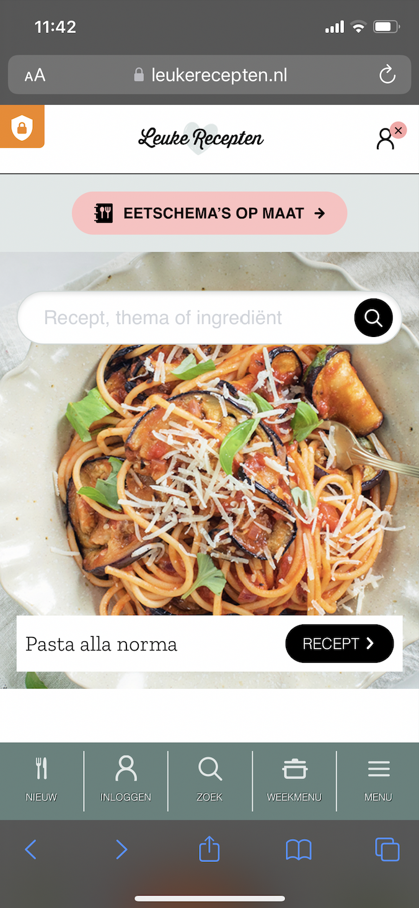
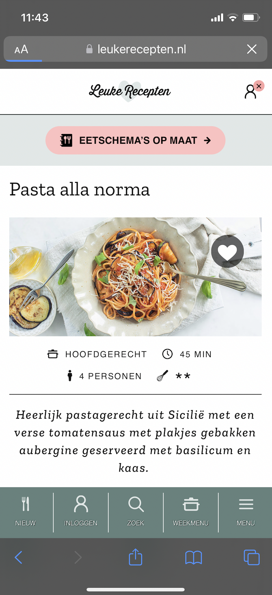
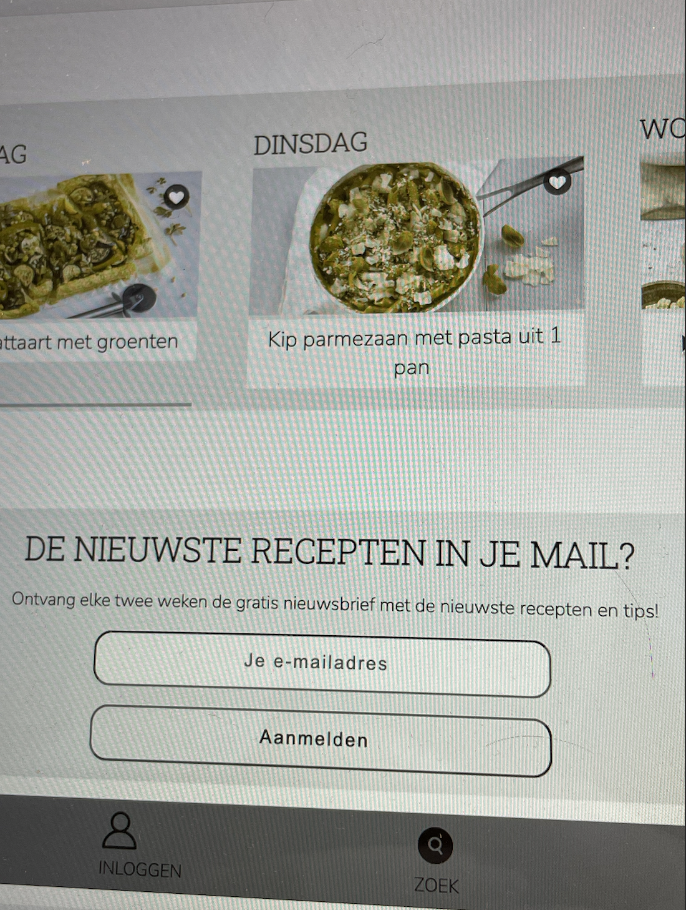
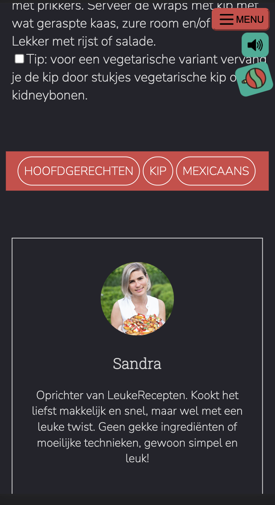

# Procesverslag
Markdown is een simpele manier om HTML te schrijven.  
Markdown cheat cheet: [Hulp bij het schrijven van Markdown](https://github.com/adam-p/markdown-here/wiki/Markdown-Cheatsheet).

Nb. De standaardstructuur en de spartaanse opmaak van de README.md zijn helemaal prima. Het gaat om de inhoud van je procesverslag. Besteedt de tijd voor pracht en praal aan je website.

Nb. Door *open* toe te voegen aan een *details* element kun je deze standaard open zetten. Fijn om dat steeds voor de relevante stuk(ken) te doen.

## Jij

  
uitwerken voor kick-off werkgroep

  ### Auteur:
  Kimberly Zhan

  #### Je startniveau:
  blauw

  #### Je focus:
  surface plane
 

## Je website

  
uitwerken voor kick-off werkgroep

  ### Je opdracht:
  https://www.leukerecepten.nl

  #### Screenshot(s) van de eerste pagina (small screen): 
  homepagina  
  
  
  
  

  #### Screenshot(s) van de tweede pagina (small screen):
  recepten pagina
  
  
  
  
 

## Toegankelijkheidstest 1/2 (week 1)

  
uitwerken na test in 1e werkgroep

  ### Bevindingen
  Lijst met je bevindingen die in de test naar voren kwamen:
  
  Concentratie problemen:
  -- Typen is lastig op de laptop en telefoon.

  Slechte motoriek:
  -- Het duurt wat langer om te typen en als je bijvoorbeeld 2 of 3 vingers bij elkaar had met de elastiek, dan drukte je meerdere toetsen tegelijkertijd in op je toetsenbord wat heel irritant is.
  -- Op mobiel is het moeilijk typen en navigeren. Is ook lastig om bijvoorbeeld een pop-up weg te klikken en om bij kruisjes en buttons in de hoek te komen.

  Visuele beperkingen:
  -- Blurry bril is irritant en ik kon de muis cursor niet goed vinden omdat het zo klein is.
  -- Bril waarbij bepaalde hoeken werden bedekt was ook irritant omdat je helemaal je hoofd moet ronddraaien om iets te kunnen zien.
  -- Geen bril op (geen sterkte) was pijnlijk aan mijn ogen omdat ik heel dichtbij het scherm zat te kijken.
  -- Lage helderheid op de laptop was te doen maar ook pijnlijk omdat ik dichtbij het scherm zat te kijken.

  Spasmes Parkinson:
  -- Kleine knopjes zoals weg-klik-kruisjes en radio buttons zijn lastiger om aan te klikken. Ik moet me meer concentreren ervoor.
  -- Scrollen is erg lastig omdat je een lange "stroke" moet vegen om te scrollen en met de elektrische simulator trilt je hand steeds waardoor je niet goed kon scrollen.

  #### Screenreader
  Hier korte omschrijving (met indien nodig afbeeldingen)

  Ik had eerst bij de instellingen op mijn laptop wat dingen veranderd aan de voice-over, bijvoorbeeld de snelheid en of die monotoon of niet praat etc.
  Ik snapte eerst niet hoe je je toetsenbord moest gebruiken om te navigeren door een site, maar ik vroeg Yeliz om hulp en toen begreep ik het beter. 

  Ik heb ontdekt dat mijn gekozen site (leukerecepten.nl) geen "focus" had wanneer je door de homepagina "tabt" met de tab toets. Het sloeg allerlei knoppen over. 

  Hier een omschrijving van hoe het opgelost kan worden (met indien nodig afbeeldingen)

  #### Muis en Toetsenbord 
  Hier korte omschrijving (met indien nodig afbeeldingen)

  Dit is de opgave met volgensmij concentratie problemen als "beperking" met de ballon. Ik vond het typen erg lastig omdat ik steeds op de ballon focuste. Ik kon opzich ook de voice-over of microfoon gebruiken om iets in te laten typen in een tekstveld.

  Hier een omschrijving van hoe het opgelost kan worden (met indien nodig afbeeldingen)

  Letters groter maken, korte zinnen gebruiken en niet te moeilijke woorden gebruiken. Ook plaatjes gebruiken als instructies ipv een lijst met instructies. One-action-per-screen, voice-over gebruiken.

  #### Motoriek (shocks, elastiekjes)
  Hier korte omschrijving (met indien nodig afbeeldingen)

  Ik had elastiekjes om mijn vingers gedaan. Ik gebruik bijna al mijn vingers om te typen op mijn toetsenbord, dus het was even wennen toen ik de elastiekjes om had. Ik moest me meer concentreren met welke vinger ik op welke toets leg. Het duurde langer voor mij om iets in te typen. Scrollen ging wel goed. Ik had ook drie vingers samen in een elastiek gestopt en ik had toen moeite met toetsen indrukken omdat drie vingers veelste breed zijn voor 1 zo'n kleine toets. Ik drukte dan vaak twee toetsen tegelijkertijd in. Op mobiel is ook moeilijk typen en navigeren als je ergens op een kruisje ver in de hoek moet drukken bijvoorbeeld. Bij de elektrische stimulator ontdekte ik vooral dat het moeilijk is om te scrollen en kleine radio buttons etc in te drukken.

  Hier een omschrijving van hoe het opgelost kan worden (met indien nodig afbeeldingen)

  Shortcuts gebruiken, grotere letters en woorden. Alles meer dichtbij elkaar zetten en voice-over. Hover gebied om te klikken kan groter gemaakt worden, grotere knoppen en via pijltjes scrollen of automatisch kunnen scrollen.

  #### Visueel (brillen, contrast, kleurenblind, dark/light). 
  Hier korte omschrijving (met indien nodig afbeeldingen)

  De gele bril veranderde niet veel voor mij qua functionaliteit. Alle woorden en knoppen waren nog te zien. Iets zien met de blurry bril was wel erg lastig en ik zag eigenlijk vrij weinig. Ik kon de vlakken zien van wat kleuren van de foto's maar geen woorden of iets. Ook kon ik met de blurry bril niet goed de cursor van mijn muis zien omdat het zo klein is. Ik had ook geprobeerd iets op mijn laptop te zien met lage helderheid. Ik kon alleen iets zien wanneer ik dichtbij het scherm zat en dat deed pijn aan mijn ogen etc.

  Hier een omschrijving van hoe het opgelost kan worden (met indien nodig afbeeldingen)

  Hogere contrast maken, grotere letters en woorden, voice-over.

## Breakdownschets (week 1)

  
uitwerken na afloop 2e werkgroep

  ### de hele pagina: 
  

  ### dynamisch deel (bijv menu): 
  

  ### wellicht nog een dynamisch deel (bijv filter): 
  

## Voortgang 1 (week 2)

  
uitwerken voor 1e voortgang

  ### Stand van zaken
  hier dit ging goed & dit was lastig (neem ook screenshots op van delen van je website en code)
  
   --Ik snapte eerst nog niet echt hoe ":nth-of-type" werkt, maar het is me gelukt. Had even problemen met hoe ik de selector moest opstellen voor :nth-of-type. Ik had ook even wat struggles met positioneren, maar het bleek dat ik verward was met wat ik precies aan het stylen was (lange dag geweest vandaag).

  ### Agenda voor meeting
  samen met je groepje opstellen

  | student 1      | student 2          | student 3    | student 4        |
  | ---            | ---                | ---          | ---              |
  | dit bespreken  | en dit             | en ik dit    | en dan ik dat    |
  | en dat ook nog | dit als er tijd is | nog een punt | dit wil ik zeker |
  | ...            | ...                | ...          | ...              |

  ### Verslag van meeting
  hier na afloop snel de uitkomsten van de meeting vastleggen

  - Ik stelde wat vragen over "nth-of-type" en ik snap het beter nu.

## Voortgang 2 (week 3)

  
uitwerken voor 2e voortgang

  ### Stand van zaken
  hier dit ging goed & dit was lastig (neem ook screenshots op van delen van je website en code)

  Ik had vorige week uitleg gevraagd om "nth-of-type()" en ik dacht dat ik het begreep, maar toen ik deze week mijn CSS probeerde te stylen ging het niet overal goed :'). Met huiswerk had ik er geen problemen mee, maar ik weet niet echt hoe het werkt als ik nu 2 verschillende HTML pagina's heb ipv 1 (wat met het huiswerk en de uitleg het geval was).

  ### Agenda voor meeting
  samen met je groepje opstellen

  | student 1      | student 2          | student 3    | student 4        |
  | ---            | ---                | ---          | ---              |
  | dit bespreken  | en dit             | en ik dit    | en dan ik dat    |
  | en dat ook nog | dit als er tijd is | nog een punt | dit wil ik zeker |
  | ...            | ...                | ...          | ...              |

  ### Verslag van meeting
  hier na afloop snel de uitkomsten van de meeting vastleggen

  - dinsdag laten zien wat ik heb en hoe ver ik ben, als dinsdag alles netjes is en mooi dan gaat de tweede veel beter.
  - alle elementen een voor een maken dus eerst de header mooi maken en dan zo naar het volgende element gaan, stap voor stap naar beneden werken.
  - focus op 1 pagina eerst en dan pas de op de 2de focussen want dan wordt de 2de pagina makkelijker.
  - eerst een van de twee pagina's maken: beter 1 mooie pagina dan 2 lelijke pagina's.
  - verwerk alle huiswerk stof en info in mijn site dus animaties, transitions, JS, positioneren, media-queries etc.
  - dingen naast elkaar zetten? --> gebruik flexbox.

  - mijn vraag was: hoe werkt het met "nth-of-type()" wanneer ik 2 HTML pagina's heb
    - antwoord: voeg een class toe aan de body van een van de twee pagina's (dus geen class toevoegen aan sections ofs).
      - voorbeeld:
      class: "anders";

      .anders section:nth-of-type() {

      }

## Toegankelijkheidstest 2/2 (week 4)

  
uitwerken na test in 8e werkgroep

  ### Bevindingen
  Lijst met je bevindingen die in de test naar voren kwamen (geef ook aan wat er verbeterd is):

  #### Screenreader
  Hier korte omschrijving (met indien nodig afbeeldingen)

  

  Eigen test met eigen site: Stem las ook de alt texts van plaatjes voor maar omdat de voice-over in het Engels is, klonk het heel trippy met de Nederlandse alt texts. Safari en Chrome is anders en andere resultaat.

  

  Kayane die mijn site testte: stem las alles in het Engels voor. In Safari skipte de Voice-Over de content en ging alleen langs de buttons en input fields. Ook las het de letters een voor een voor en de alt texts van plaatjes die ik heb gebruikt voor de iconen. In Chrome leest de Voice-Over wel de content/main voor en gaat langs de linkjes in mijn lijstjes. 

  

  Feedback docent: zijn de linkjes duidelijk? Bijvoorbeeld "recept" button, recept van wat precies? Voor iemand die beperking heeft aan ogen of iets, kan het onduidelijk zijn. (Bijvoorbeeld linkjes genaamd "Lees meer..." en "Find more...). 

  Hier een omschrijving van hoe het opgelost kan worden (met indien nodig afbeeldingen)

  Gebruik aria-labels bijvoorbeeld om de linkjes duidelijker te maken. 

  #### Muis en Toetsenbord 
  Hier korte omschrijving (met indien nodig afbeeldingen)

  Navigeren met tab: de tab gaat alleen langs de buttons en input fields en de linkjes naar recepten. Het selecteert geen plaatjes. Met de tab laten ze de "normale" state van buttons weer en de "focus" states van buttons (ik heb de focus states van buttons al gestyled).

  Hier een omschrijving van hoe het opgelost kan worden (met indien nodig afbeeldingen)
  Misschien om de sections die niet "gefocust" worden, een linkje zetten ("a") en dan een # in plaatsen zodat de tab de sections wel mee pakt.

  #### Motoriek (shocks, elastiekjes)
  Hier korte omschrijving (met indien nodig afbeeldingen)

  Elastiekjes: het scrollen en typen ging allemaal goed. Moest weer even wennen aan de posities van toetsen en de "bijbehorende vingers" van de toetsen.

  Shocks: scrollen ging langzaam. Het klikken van buttons ging goed. Tussendoor ging Kayane nog iets naar mij airdroppen en ik kon gemakkelijk op de kleine "x" knopjes klikken etc. Het horizontaal scrollen bij "Sandra's weekmenu" ging lastiger dan verticaal scrollen.

  Hier een omschrijving van hoe het opgelost kan worden (met indien nodig afbeeldingen)

  Pijltjes waar je op kan klikken om naar links of rechts te scrollen in een horizontale slider.

  #### Visueel (brillen, contrast, kleurenblind, dark/light). 
  Hier korte omschrijving (met indien nodig afbeeldingen)

  Bril met zwart vlekje in het midden:
  Alles is moeilijk leesbaar. Alleen als ik mijn hoofd kantel of als ik voorbij het vlekje de content scroll, dan kan ik nog dingen lezen. Het is ook wat wazig. Het geluidsknopje kon ik niet goed zien toen het ging switchen tussen "geen geluid" icoontje en "wel geluid" icoontje. Dat was moeilijk te volgen.

  Bril met bedekt vizier en alleen een puntje waar je door kan kijken:
  Dit ging eigenlijk beter dan verwacht. Het was wazig maar nog wel een beetje te doen. De kleine p teksten waren wel wat onleesbaar. Het geluidsknopje kon ik niet goed zien toen het ging switchen tussen "geen geluid" icoontje en "wel geluid" icoontje. Dat was moeilijk te volgen. In dark mode kon ik slecht de namen van recepten lezen van de sectie "Populaire thema's" wanneer ik er overheen hoverde met de cursor. De blauwe letterkleur met het gele op de achtergrond geeft geen hoog contrast.

  

  

  Kleurenblind:
  Het geluidsknopje heeft een andere kleur dan de achtergrond waar het op zit, maar met de "zwart-wit kleurenblindheid" valt het knopje weg naar de achtergrond en zie je alleen het icoontje. Het is dan niet duidelijk genoeg dat het een button is en dat je er op kan klikken.

  

  Bij de verschillende soorten kleurenblindheid, vond ik ook dat de input field en de button voor "aanmelden" (voor nieuwsbrief) bijna hetzelfde lijken. De contrast is niet hoog en het lijkt op elkaar. De button voor "aanmelden" lijkt dan niet meer op een button maar lijkt bijna op een input field.

  

  

  

  Hier een omschrijving van hoe het opgelost kan worden (met indien nodig afbeeldingen)

## Voortgang 3 (week 4)

  
uitwerken voor 3e voortgang

  ### Stand van zaken
  hier dit ging goed & dit was lastig (neem ook screenshots op van delen van je website en code)

  Ik heb geprobeerd om met Javascript een geluidsknopje te maken waarmee je een achtergrondmuziekje op pauze kon zetten en weer verder kan afspelen op de site. Het knopje verandert wel heen en weer tussen de geluidsiconen maar ik hoor helaas geen audio.

  

  Ik weet niet precies hoe je knopjes kan maken waarmee je door de slider van Sanra's weekmenu kan scrollen door op links of rechts te klikken. Ik had het opgezocht op internet en dat moest allemaal met Javascript maar ik snap heel de Javascript niet :(. En ik wil graag dat het kopje "Sandra's weekmenu" in de gekleurde section komt te staan maar wanneer ik dat wil doen, verandert heel mijn slider en komt alles raar te staan.

  

  Ik weet niet hoe je de button voor "aanmelden" bij de nieuwsbrief onderaan de pagina een andere kleur kan geven :').

  

  (Dit vind ik niet een heel groot probleem) De iconen voor in mijn navigatiebalk onderaan de pagina staan niet precies mooi in het midden boven de teksten. Ik weet niet hoe dat moet en heb al align-items, justify-content, text-align en align-self etc. gebruikt.

  Bij beoordelingsformulier staat ook dat je site moet doen op iPhone SE tot Galaxy Note (allebei small screen size volgensmij?), maar ik heb mijn site niet voor een bepaalde schermafmeting gemaakt. Ik bekijk en check mijn site altijd op Safari met Live Server en dan verklein ik mijn scherm tot meest smalle breedte die Safari toe laat. Toen ik het op Google Chrome testte (want daar kan je "inspect" doen en je site in verschillende device afmetingen bekijken) zag heel mijn site er als crack uit en ging alles lelijk zitten.
  Mijn vraag is of dat heel erg is? Want ik heb voor Surface Plane gekozen, maar mijn site is niet ontworpen voor iPhone SE tot Galaxy Note wat wel in de beoordelingsformulier stond als "eis" die je sowieso moet hebben. Is het erg als mijn site er dus alleen "goed" uit ziet via smalste schermbreedte van Safari (en lelijk is op Google Chrome wanneer ik wil inspecteren).

  Mijn andere probleem is dat ik mijn hele site niet op Github kan uploaden met alle files want ze zeggen dat het te groot is. Het moet kleiner dan 25MB zijn.

  ### Agenda voor meeting
  samen met je groepje opstellen

  | student 1      | student 2          | student 3    | student 4        |
  | ---            | ---                | ---          | ---              |
  | dit bespreken  | en dit             | en ik dit    | en dan ik dat    |
  | en dat ook nog | dit als er tijd is | nog een punt | dit wil ik zeker |
  | ...            | ...                | ...          | ...              |

  ### Verslag van meeting
  hier na afloop snel de uitkomsten van de meeting vastleggen

  - Site moet wel via Google Chrome goed te zien zijn dus ik moet wel even opnieuw positioneren etc. 
  - Vraag over Javascript met de geluidsknop moet even bij de Eva's via Teams vragen.
  - Iconen staan mooi recht in het midden boven de titels in de navigatiebalk onderaan de pagina met hulp van studentassistente.
  - Button kleur veranderd van "aanmelden" knop in nieuwsbrief met hulp van studentassistente.

## Eindgesprek (week 5)

  
uitwerken voor eindgesprek

  ### Je uitkomst - karakteristiek screenshots:
  
  
  

  ### Dit ging goed/Heb ik geleerd: 
  Korte omschrijving met plaatjes

  
  Ik heb geleerd wat een :root is en dat je ook Dark Mode kan coderen. Ik wist niet dat dat kon! Heel gaaf. Dark Mode is me goed gelukt, alleen ik wist eerst niet welke kleuren ik voor Dark Mode wilde gebruiken. Ik wilde dichtbij de "originele" kleuren blijven en ook genoeg contrast behouden met de kleur van teksten.

  
  Ik heb geleerd hoe je een horizontale slider kan maken met HTML en CSS. Ik had nog nooit met "overflow" gewerkt. 

  
  
  
  Ik heb geleerd hoe je var() kan gebruiken voor je huisstijl kleuren wat handiger is dan dat je bepaalde kleuren codes met allerlei nummers en letters uit je hoofd moet leren of steeds copy+paste moet doen. Ook kan je in een keer je huisstijl kleuren aanpassen. Ik heb ook geleerd hoe je display: grid; moet gebruiken Ik vind grid echt heel erg lastig. Ik heb grid gebruikt om bijvoorbeeld mijn afbeeldingen in twee kolommen naast elkaar te zetten. Ook heb ik ":nth-of-type()" geleerd. Voor mij is nth-of-type helemaal nieuw. Eerst had ik er wat moeite mee, want ik wist niet zo goed hoe je een specifieke tag moest "selecteren" met nth-of-type. Omdat je bij deze opdracht niet zomaar classes, id's en div'jes mag gebruiken, werd ik geforceerd om nth-of-type continu te gebruiken en ik kreeg het uiteindelijk onder de knie. 

  
  
  Ik heb voor het eerst forms en labels met input gebruikt. Op de een of andere manier vond ik het altijd verwarrend of forms en labels altijd samen worden gebruikt en ik wist eerst niet goed hoe je forms uberhaupt moest gebruiken. En met input heb je ook nog verschillende soorten "type"? Met dingen als submit etc. wat ik niet goed snapte.

  
  Ik heb geleerd dat aria-labels bestaan en heb geleerd in welke gevallen je ze kan gebruiken en hoe je ze moet gebruiken. Erg handig!

  
  Ik heb geleerd hoe je animations kan maken met keyframes. Het is even denken met die dingen 0% tot 100% en alles daartussen, maar de huiswerk opdrachten hebben me goed geholpen.

  ### Dit was lastig/Is niet gelukt:
  Korte omschrijving met plaatjes

  
  Ik vond het lastig om deze section zo eruit te laten zien met de plaatjes links en titels rechts en alles mooi uitgelijnd en recht. Dit is een section van de tweede pagina (recept.html) waar ik een class aan de body heb toegevoegd om CSS te kunnen "scheiden" van de eerste en tweede HTML pagina met zo min mogelijk gebruik van classes. Toen ik aan de CSS styling van de tweede pagina wilde beginnen, waren een paar dingen al gestyled omdat CSS al een beetje styling had overgenomen van de eerste pagina CSS. Ik vond het toen moeilijk om van bepaalde CSS styling de "originele"/"basic"/"default status in te typen. Ik heb dus ontdekt dat de default van "background-color" gewoon "transparent" is en de default van "overflow-x" is "unset". En om "display: grid;" soortvan weg te halen moet je "default: block;" gebruiken volgens mij. Ook geleerd dat je "position: static;" moet gebruiken om "position: absolute;" uit te cancelen. Ik zou nooit achter dit soort dingetjes zijn gekomen als ik wel met zoveel mogelijk classes etc. mocht werken.

  
  Ik vodn het lastig om de iconen (images) recht boven de titels/texts te zetten. Dus het ziet er niet heel netjes en strak uit.

  
  Ik had wat struggles met mijn kerst thema aan en uit roepen. Ik had wat rond gespeeld met Javascript en if-else statements. Het aanroepen van mijn kerst thema, waarbij verschillende hidden images tevoorschijn kwamen, ging opzich goed. Maar wanneer ik weer op mijn kerst thema button wilde klikken, gingen de hidden images niet meer weg. Ik kon nergens anders op mijn scherm klikken van mijn site. Ik kon toen alleen mijn kerst thema weghalen door mijn site te refreshen. Ik heb de studentassistente gevraagd en het werkt nu wel! Alleen (bij mij tenminste) kan ik mijn kerst thema aan- en uitklikken wanneer ik niet in de "responsive mode" van Google Chrome's inspect optie zit. Helaas heb ik nog wel wat flaws met mijn kerst thema want zodra ik het aan heb geklikt, worden de buttons (menu, achtergrondgeluid knopje en kerst thema knopje) helemaal uit beeld geduwd naar de rechterkant. Dus het werkt nog niet helemaal 100% perfect.

  
  Wanneer kerst thema aan wordt gezet, dan verdwijnen de 3 buttons (menu, achtergrondgeluid knopje en kerst thema knopje) helemaal uit beeld aan de rechterkant. Je moet dan naar rechts scrollen (buiten iPhone SE veld). Ik snap niet waarom alle drie de buttons weg worden geduwd maar ik denk dat het komt door de position: absolute; wat naast elementen worden geplaatst die position: fixed; hebben, denk ik?

## Bronnenlijst

  
continu bijhouden terwijl je werkt

  Nb. Wees specifiek ('css-tricks' als bron is bijv. niet specifiek genoeg).

  1. blauw hartje icoon: https://www.rockridgelittleschool.com
  2. pijltje icoon navigatie voor "eetschema's op maat": https://www.flaticon.com/free-icon/right-arrow_724976
  3. search icon button zoekbalk homepagina: https://thenounproject.com/icon/search-button-1073881/
  4. kookpot icoon: https://www.inventicons.com/icon/pot-3377
  5. garde icoon: https://www.flaticon.com/free-icon/whisk_2772021
  6. persoon silhouette: https://www.nicepng.com/ourpic/u2q8a9e6o0e6q8r5_person-icon-black-01-person-icon-black/
  7. timer klokje icoon: https://www.freeiconspng.com/images/timer-icon
  8. mes en vork icoon: https://icon-library.com/icon/fork-and-knife-icon-5.html
  9. account poppetje icoon: https://freeicons.io/seo/forward-user-profile-icon-6314
  10. hamburger menu icoon: https://icon-icons.com/nl/pictogram/hamburger-knop-menu/155296
  11. wit hartje voor favorieten: https://www.clipartmax.com/middle/m2i8i8m2G6m2H7b1_free-transparent-clipart-png-transparent-icons-heart-icon-png-white/
  12. kruisje icoon menu: https://icon-icons.com/nl/pictogram/kruis-symbool/74149
  13. cooking mama achtergrond muziekje: https://youtu.be/hu84AJmn43I
  14. kerst bal: https://dribbble.com/shots/2393762-Christmas-Icons-Full-Set-Free-download
  15. sneeuw: https://www.freepik.com/free-photos-vectors/snow-falling-transparent
  16. kerstman met slee en rendieren: https://www.downloadclipart.net/browse/75564/santa-sleigh-png-photo-clipart
  17. kerst decoratie hoekje: https://www.dlf.pt/ddetail/ihwxJow_christmas-decorations-clipart-transparent-cartoons-christmas-decorations-transparent/
  18. kerst ster: https://www.freeiconspng.com/images/christmas-star-png
  19. verbod symbool: https://www.pngwing.com/en/free-png-zcyrx
  20. kerst achtergrond muziekje: https://youtu.be/R1gskElaLNo
  21. AH logo: https://boodschappenaanbiedingen.com

